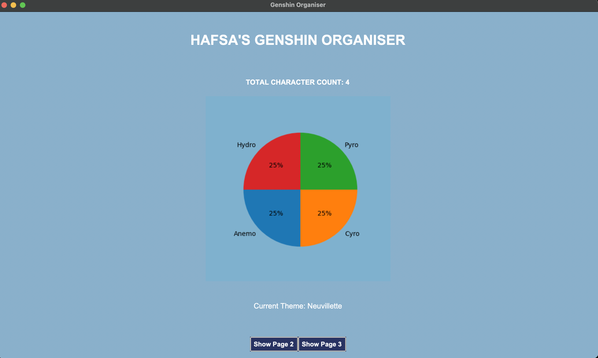

# GenshinCharactersOrganiser

This project was created for my final assignment with the brief to create a file manager. I selected Genshin as my organisational topic of choice and developed experience and confidence in using tkinter. 


## UML DIAGRAMS

I used Mermaid Live Editor to make a frame for my three classes:

```
mermaid
classDiagram
class Characters{
     name 
     element 
     character_star
     character_level 
     max_hp 
     base_ATK
     elemental_skill
     elemental_burst
     region
     weapon_owned
     Character.count
}

class GenshinOrganiser{  
    ttk.Style
    buttons
    labels
    entryboxes
    add_treeview()
    update_character()
    delete_character()
    sort_characters()
    clear_boxes()
    search_character()
    select_character
    add_character()
}

    GenshinOrganiser <|-- IntroPage

class IntroPage{
    labels
    buttons
    stats e.g. no* characters inputted
    graph e.g. piechart
}
```
## Improvements and Future Improvements
Some of the key improvements from my submission last year are:
* Improved and consistent commenting
* Use of for loops to increase readability a of code

An improvement to incorporate next is:
* To reduce blocks of repeated code present in functions

## 📁 Project Structure

```

├── GenshinOrganiser.py
├── genshinCharacters.csv
└── README.md


```


##  Page 1: Home:



Users can:
* Get total character count
* See the distribution of elements of character they own
* See the current colour theme


## Page 2: Search and Filter page:


Users can:
* Sort character
* Search for characters
* Filters based on different character features

## Page 3: Edit Page:


Users can:
* Edit characters
* Delete characters
* Add characters
* Update character records


## 🛠️ Installation

Python 3.10 or newer to run python files

Python modules used: 
* csv - used to load csv for treeview.
* pandas – reading and handling CSV files.
* matplotlib – plotting piechart.
* tkinter - creating window.
* os – checking if files exist.


You can install required packages with:

```
pip install csv, pandas, matplotlib, tkinter, os

```

## 📄 License
This project is open source and available under the [MIT License](https://github.com/hafybufya/genshin-characters-organiser/blob/main/LICENSE).

